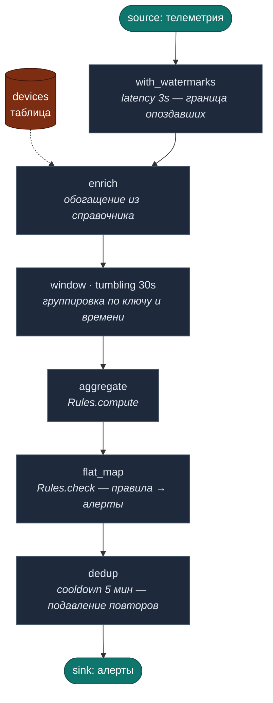

# miniFlink

Декларативная потоковая обработка данных на OCaml.

По сути это **декларативный streaming DSL для OCaml**, реализующий семантику
Apache Flink **на одном узле**. Акцент — на чистоте и выразительности модели
обработки (event time, окна, состояние, exactly-once), а не на распределённом
выполнении. Распределённость, remote shuffle и кластерная отказоустойчивость —
сознательно вне области проекта (см. Non-goals); это позволяет держать ядро
маленьким и понятным. Если нужен распределённый стоимостью промышленный движок —
это Flink; если нужна понятная, типобезопасная, тестируемая модель потоковой
обработки на одной машине — это miniFlink.

Реализация ключевых концепций Apache Flink: event time, watermarks, windowing
(tumbling, sliding, count, session со слиянием, global+triggers) с
инкрементальной агрегацией и комбинируемыми агрегаторами, stateful
operators, exactly-once (end-to-end: offset, 2PC sink, recovery, durable),
table/join с TTL (+ temporal as-of join), union потоков, retractions — плюс production-слои
(DLQ + retry/backoff, graceful shutdown, Prometheus metrics, структурированные
логи, health, config, RocksDB state). ~4100 строк OCaml, 49 тест-сюит.

## Почему декларативно

```ocaml
(* Весь pipeline — 10 строк, нет аннотаций типов, нет key_by *)
let pipeline source =
  source
  |> Event.with_watermarks   ~latency:(seconds 3)
  |> Pipe.enrich (module Telemetry)
       ~from:devices
       ~merge:(fun t dev -> { t with device = dev })
  |> Pipe.window (module Telemetry) (Pipe.tumbling (seconds 30))
  |> Pipe.aggregate              Rules.compute
  |> Pipe.flat_map               (Rules.check Rules.fleet)
  |> Pipe.dedup (module Alert)
       ~rule:(fun a -> a.rule)
       ~cooldown:(minutes 5)
```

`key_by` спрятан в `window` через type class `KEYED` — ключ описывается один раз в типе.

Тот же конвейер как поток данных:


Смена формата (JSON → Protobuf) — одна строка в codec. Pipeline не меняется.

## Структура

```
lib/                 — библиотека miniflink
  Ядро (не меняется):
    stream.ml          pull-based поток: unit -> 'a option
    mf_event.ml        Data | Watermark | Retract | Update (атомарная коррекция)
    pipe.ml            enrich, window, aggregate, dedup, flat_map
    keyed.ml           type class KEYED — убирает ~key: из операторов
    table.ml           Static | Snapshot таблицы
    time.ml            seconds, minutes, hours
    codec.ml           JSON / Protobuf абстракция
    domain.ml          типы с [@@deriving yojson, show]
    rules.ml           чистая бизнес-логика
  Параллелизм:
    channel.mli        интерфейс канала
    parallel.mli       интерфейс parallel runner
    (channel.ml и parallel.ml генерируются dune из variants/)
  Production слои (все опциональны, noop по умолчанию):
    dlq.*              dead letter queue (noop | log)
    shutdown.*         graceful shutdown (noop | SIGTERM drain)
    metrics.*          Prometheus метрики (noop | log + HTTP endpoint)
    barrier.*          exactly-once parallel (Chandy-Lamport)
    state_backend.*    персистентный стейт (noop | memory | rocksdb)
    schema.*           schema evolution + migration
    harness.*          тестовый фреймворк
    runtime.ml         сборка всех слоёв
    fixtures.ml        тестовые данные

variants/            — реализации channel/parallel по версии OCaml
  channel_v4.ml        Mutex + Condition (OCaml 4 Thread)
  channel_v5.ml        Atomic lock-free SPSC (OCaml 5 Domain)
  parallel_v4.ml       Thread.create / Thread.join
  parallel_v5.ml       Domain.spawn / Domain.join

bin/    main.ml        демо pipeline
examples/              самодостаточные примеры (см. examples/README.md)
bench/  bench.ml bench_parallel.ml bench_ex07.ml soak.ml
test/   49 тест-сюит (core, props, invariants, reliability, metrics,
                     retract, sliding, count_window, session_window,
                     global_window, window_fold, agg, union, safe, parallel_retract,
                     side_output, ttl_state, nexmark, watermark_fuzz, timers,
                     recovery, differential, cardinality, temporal,
                     dedup_evict, parallel_crash, crash_checkpoint,
                     determinism, watermark, idle_watermark, table_ttl,
                     checkpoint_parallel, rocksdb, codec, channel,
                     window_validation, log, health_config, retry,
                     schema, backpressure, queue_depth, ex07_smoke, ex07_lib)
```

### Практика: каждый найденный баг → тест

При нахождении бага (своими руками, через ревью, по жалобе пользователя)
**сначала пишем падающий тест**, который его воспроизводит, и только
потом фикс. Это закрепляет инвариант: репликация регресса не уйдёт
тихо, и тест остаётся живой документацией «это уже было сломано, не
ломайте снова». Примеры исторически принятых уроков:

- `test_fan_out.ml :: test_concurrent_block_drain` — гонка данных при
  конкурентном чтении Block-выходов (ловит регресс синхронизации).
- `test_timers.ml :: test_emit_time_composes_with_window` —
  `process_keyed` не должен эмитить с `ts=0` (иначе выход не
  композируется с окнами).
- `test_timers.ml :: test_timer_idempotent_set` +
  `test_timer_cancel_removes_both_logical` — Flink-семантика
  идентичности таймера по `(key, t)`: два set сливаются, cancel
  снимает обе логические записи. На этом легко наступить.
- `test_timers.ml :: test_timer_fires_at_scheduled_time_not_wm` —
  `on_timer` получает `now` = время по расписанию, не текущий
  watermark, и оно может быть **в прошлом** относительно уже
  обработанных данных.
- `test_dedup_evict.ml :: test_dedup_passes_late_drops_duplicate` —
  `dedup` срубает дубль, но пропускает честный опоздавший пакет,
  который вызывает retract уже закрытого окна.
- `test_ex07_smoke.ml` — end-to-end smoke ex07: вывод содержит все
  типы алертов, M6 имеет одновременно все четыре, дубли и ретракты
  посчитаны, координаты прорисованы. Защищает от молчаливого
  регресса семантики окон/таймеров через example.

Сборка через **dune**. `channel.ml`/`parallel.ml` выбираются автоматически
по версии OCaml через `(rule (enabled_if (>= %{ocaml_version} 5.0.0)))` —
никакого ручного `cp`.

## Использование как зависимость

В своём проекте добавь зависимость и подтяни miniFlink через opam pin
из git (публикации в opam-репозиторий нет — это своя библиотека):

```bash
opam pin add miniflink https://github.com/slyzhnyak/miniFlink.git
```

В `dune-project` приложения: `(depends miniflink ...)`, в `dune`
библиотеки/бинаря приложения — `(libraries miniflink ...)`. Модули под
namespace `Miniflink.*` (`Miniflink.Pipe`, `Miniflink.Stream`, ...), либо
`open Miniflink` в начале файла.

Системное требование: **`librocksdb-dev`** должна быть установлена (C FFI
для персистентного state backend) — opam её не ставит сам, поставь
вручную (`apt install librocksdb-dev`) перед сборкой.

## Запуск

> Подробная инструкция для Debian Stable + OCaml 5 (с настоящей
> параллельностью через Domain): см. [INSTALL.md](INSTALL.md).
> Ниже — краткий рецепт для OCaml 4.14 на Ubuntu/Debian.

```bash
# Зависимости (Ubuntu/Debian)
apt install ocaml-dune ocaml-findlib
apt install libppx-deriving-yojson-ocaml-dev libyojson-ocaml-dev libqcheck-ocaml-dev
apt install librocksdb-dev   # для персистентного state backend (C FFI)

# Сборка — dune сам выберет v4 (OCaml 4) или v5 (OCaml 5)
dune build

# Запуск демо
dune exec bin/main.exe          # тестовые данные (noop режим)
dune exec bin/main.exe log      # log режим: метрики в stderr

# примеры использования (со своими типами, от простого к сложному)
dune exec examples/ex01_minimal.exe   # окна + агрегация
dune exec examples/ex02_alerts.exe    # enrich + правила + dedup
dune exec examples/ex03_windows.exe   # четыре типа окон
dune exec examples/ex04_mine.exe      # комплексная топология (шахта)
dune exec examples/ex05_fleet.exe     # production-путь: EO+recovery, Agg, safe_map, schema
dune exec examples/ex06_topology.exe  # модель исполнения B+C: merge+fan_out+supervisor
dune exec examples/ex07_location/ex07_location.exe  # локация шахтёра: median RSSI, sliding, top-2 + координаты

# Бенчмарки
dune exec bench/bench.exe              # базовый: throughput single + parallel
dune exec bench/bench_parallel.exe     # параллелизм по ядрам
dune exec bench/bench_ex07.exe         # большая шахта (1M пакетов, ~90 сек)
dune exec bench/bench_changed_paths.exe -- 1000000  # filter + group_by под объёмом

# Все тесты (быстрые, входят в CI)
dune test

# Soak-тесты (медленные, вручную): проверка отсутствия утечек памяти
dune exec bench/soak.exe     -- 5000000  # window/dedup/enrich
dune exec bench/soak_agg.exe -- 5000000  # group_by/window_agg/filter + late data
```

## Выбор режима

```ocaml
Runtime.run Runtime.noop     (* тесты: нулевой overhead            *)
Runtime.run Runtime.log_cfg  (* разработка: метрики в stderr       *)
Runtime.run Runtime.parallel (* многопоточный, 4 workers           *)
Runtime.run Runtime.prod     (* всё: метрики HTTP :9090 + shutdown *)
```

Одна строка. Pipeline не меняется.

## Производительность

### OCaml 4.14 (baseline)

Xeon 2.80GHz, 1M events, 1000 devices, tumbling 30s:

| режим          | ev/s  | speedup |
|----------------|-------|---------|
| sequential     | 210K  | 1.0x    |
| 1 worker       | 152K  | 0.72x (channel overhead) |
| 2 workers      | 406K  | 1.94x   |
| 4 workers      | 519K  | 2.48x   |
| 8 workers      | 600K  | 2.87x   |

Channel overhead: ~106 нс/msg (Mutex+Condition).
Потолок параллельности на v4 — ~2.9x из-за runtime-lock (GIL).

### OCaml 5.1 (Domain.spawn, реальная параллельность)

i7-8700 @ 3.2 GHz, 6 физ + HT = 12 логических ядер,
500K events, 1000 devices, tumbling 30s:

| воркеров   | время (с) | ev/s  | speedup |
|------------|-----------|-------|---------|
| sequential | 12.79     | 39K   | 1.00x   |
| 1          | 13.15     | 38K   | 0.97x   |
| 2          | 5.77      | 87K   | 2.22x   |
| 4          | 2.79      | 179K  | 4.58x   |
| 6          | 2.62      | 191K  | 4.89x   |
| 8          | 2.56      | 195K  | 5.00x   |
| 12         | 2.24      | 223K  | **5.71x** |

Замер: `dune exec bench/bench_scaling.exe` (warmup + 4 прогонов, p95).
Видно линейное масштабирование до 4 воркеров (4.58x, эффективность
~115% на ядро — выигрыш от L3 cache distribution). Колено на ~4
воркерах — sink-mutex и dispatcher становятся bottleneck'ом. HT даёт
+14% сверх физических ядер (5.00 → 5.71). Сравнение **5.71x vs 2.87x**
на OCaml 4 — это и есть настоящая выгода Domain.spawn без runtime-lock.

Сравните цифры sequential между v4 и v5: 210K (Xeon @2.8) vs 39K
(i7-8700 @3.2) — НЕ опечатка, это разные нагрузки (1M событий vs
500K, разный размер окна и enrichment). Per-machine OCaml 5 быстрее
OCaml 4 на single-thread тоже, но конкретно эти числа сравнивать
между машинами нельзя.

### Production-сценарий: ex07 на большой шахте

Бенчмарк `bench/bench_ex07.ml` прогоняет полные пайплайны примера 7
на конфигурации, близкой к реальной шахте: 16 горизонтов × 64 бикона
(1024 бикона), 16 × 256 = 4096 шахтёров, ~1 час event-time = ~950K
пакетов. С реалистичными аномалиями канала: ~3% дублей и ~3% опоздавших
(опоздание ≥ размер окна, гарантия retract). Cценарии алертов
распределены процентами: 10% No_packets, 5% No_readings, 20% No_motion,
30% Low_voltage, 1% SOS — с пересечениями.

Замеры на той же машине:

| Пайплайн                | Время  | Throughput | Heap   | Allocated |
|-------------------------|--------|------------|--------|-----------|
| `connectivity_alerts`   | 2.7 с  | 397K ev/s  | ~0.8 GB| 2.4 GB    |
| `median_rssi`           | 53 с   | 19K ev/s   | 2.0 GB | 33 GB     |

Результаты: 2416 алертов всех типов (252 NoPkt / 204 NoRd / 705 NoMot /
1217 LowV / 38 SOS), 2.65M событий окон. Опоздавшие пакеты дают
коррекции в виде **атомарных `Update`** (old→new одним событием), а не
пар `Retract`+`Data` — downstream не видит промежуточного состояния.
Пайплайн локации значительно медленнее — это цена окон с двухуровневой
агрегацией (median per beacon → top-2) плюс коррекции; именно эту цену
скрывал бы бенчмарк на «чистом» потоке без late+dups.

**Историческая справка**: первоначальные цифры на этой же конфигурации
были `median_rssi` 84с / 12K ev/s / 70 GB allocated. Миграция
`lib/window.ml` с `Map.Make` (immutable) на `Hashtbl` дала **1.63x**
ускорение и **−61% аллокаций**. Найдено через направленное профилирование
(`bench_ops` показал window-механизм 64% времени → `bench_window_ab`
подтвердил гипотезу A/B-сравнением до изменения lib).

Примечание про `group_by`: его аккумулятор, наоборот, использует
immutable `Map` (а не `Hashtbl`). Это сознательный выбор: `group_by`
участвует в коррекциях (window_fold эмитит `Update{old, new}`, где old и
new обязаны быть независимыми снимками), а mutable `Hashtbl` сделал бы
их одним объектом и молча терял бы late data. `Map` даёт immutability
дёшево (O(log n) со структурным разделением) — детали в
[docs/load-test-2026-06.md](docs/load-test-2026-06.md).

```bash
dune exec bench/bench_ex07.exe
```

### Параллельный ex07 через fan_out (OCaml 5)

`bench/bench_ex07_parallel.ml` оборачивает те же пайплайны в
{!Pipe.fan_out} через `Parallel.run_parallel_simple`, партиционируя
по `lamp`. Замер на i7-8700 (6 физ + HT = 12 логических), OCaml 5.1.1,
полная Large_mine конфигурация (~950K пакетов):

**`connectivity_alerts`** (sequential baseline на этой машине 859K ev/s,
2.4x быстрее чем на reference-машине README — `process_keyed` на
i7-8700 с большим L1/L2 заметно быстрее):

| воркеров | время (с) | ev/s   | speedup |
|----------|-----------|--------|---------|
| sequential | 1.14    |  859K  | 1.00x   |
| 1        | 1.21      |  810K  | 0.94x   |
| 2        | 0.70      | 1.41M  | 1.64x   |
| **4**    | **0.43**  | **2.30M** | **2.68x** |
| 6        | 0.59      | 1.66M  | 1.94x   |
| 8        | 1.11      |  888K  | 1.03x   |
| 12       | 1.32      |  744K  | 0.87x   |

**`median_rssi`** (baseline 44K ev/s):

| воркеров | время (с) | ev/s | speedup |
|----------|-----------|------|---------|
| sequential | 22.25   |  44K | 1.00x   |
| 1        | 22.22     |  44K | 1.00x   |
| 2        | 12.07     |  81K | 1.84x   |
| 4        |  6.92     | 142K | 3.22x   |
| 6        |  6.36     | 155K | 3.50x   |
| **8**    |  **5.33** | **184K** | **4.17x** |
| 12       |  5.93     | 166K | 3.75x   |

**Интерпретация — два разных режима, два разных потолка:**

`median_rssi` имеет «правильную» кривую: монотонный рост до 8 воркеров,
peak 4.17x на 8, лёгкая регрессия на 12 (HT не помогает CPU-bound с
большой GC-нагрузкой). 184K ev/s — это **9.7x от исходного baseline'а
до Hashtbl-миграции** (19K). Объединение «Hashtbl + fan_out» даёт
кумулятивную пользу.

`connectivity_alerts` ведёт себя {b иначе}: peak 2.68x на 4 воркерах,
потом резкая деградация до 0.87x на 12. Причина — **dispatcher single-thread
становится bottleneck'ом**. Sequential connectivity_alerts уже 859K ev/s
(~1.2 мкс на событие), Channel push/pop добавляет ~100-200нс (~10-20%
overhead на событие). На 4 воркерах работа распределяется и overhead
терпим. На 8+ dispatcher не успевает кормить столько каналов, и
параллельность уже **не покрывает** свой overhead.

**Практический вывод для production-деплоя:** оба пайплайна на одном
сервере — `connectivity_alerts` с 4 воркерами, `median_rssi` с 8 — суммарно
~12 потоков, упирается в HT-границу машины. Реальная пропускная
способность на полную смену шахты: alerts ~2.3M ev/s, location ~184K
ev/s. Это **многократно** перекрывает реальную нагрузку (~270 ev/s от
4096 шахтёров).

```bash
dune exec bench/bench_ex07_parallel.exe
```

## Production-readiness

| Компонент                   | Статус                        |
|-----------------------------|-------------------------------|
| Event time + watermarks     | ✓ реализовано                 |
| Windowing tumbling/sliding  | ✓ реализовано                 |
| KEYED type class            | ✓ реализовано                 |
| Stateful operators          | ✓ реализовано                 |
| Exactly-once (single)       | ✓ реализовано                 |
| Table + Join                | ✓ реализовано                 |
| Retractions                 | ✓ реализовано                 |
| Атомарный Update            | ✓ коррекция old→new одним событием (без flicker); корректен во всех операторах (filter, window_agg, keyed_join, trigger) |
| Параллелизм OCaml 4/5       | ✓ реализовано                 |
| Dead Letter Queue           | ✓ реализовано (noop + log)    |
| Graceful Shutdown           | ✓ реализовано (SIGTERM/INT)   |
| Prometheus Metrics          | ✓ реализовано (HTTP :9090)    |
| Изоляция исключений         | ✓ safe_map / safe_filter (битое событие → on_error, не падение) |
| Unit + Property тесты       | ✓ 88 сюит, QCheck-инварианты  |
| CI                          | ⚠ workflow написан (docs/ci/ci.yml: сборка + тесты на OCaml 4.14/5.2), но НЕ активен: токен автоматизации без workflow-scope не может пушить в .github/workflows/ — скопируйте файл туда вручную |
| Exactly-once parallel       | ✓ реализовано (barrier + snapshot) |
| Exactly-once end-to-end     | ✓ offset + 2PC sink + recovery + durable (E2E recovery harness: kill→recover→output совпадает) |
| Структурированные логи (JSON) | ✓ Log (событие+sink, назначение — за приложением) |
| Health/readiness            | ✓ Health.check (структура, не сервер) |
| Queue depth                 | ✓ хук on_queue_depth в parallel |
| Конфигурация                | ✓ Config (типизированная запись + validate) |
| Сквозной backpressure       | ✓ через цепочку bounded-каналов (доказано тестом) |
| Retry + backoff             | ✓ Retry (экспоненциальный, jitter) |
| Idle watermark              | ✓ with_idle_watermarks (wall-clock в тишине) |
| Schema evolution            | ✓ версия + миграция, явная ошибка на неизвестной версии |
| Типы окон                   | ✓ tumbling, sliding, count, session (слияние), global+triggers |
| Агрегация окон              | ✓ инкрементальная (window_fold) + комбинируемые агрегаторы (Agg) |
| Stream-table join           | ✓ enrich (snapshot) + temporal_join (as-of, корректен при опоздавших апдейтах) |
| Persistent state (RocksDB)  | ✓ реализовано (C FFI, librocksdb) |
| Источники/sink              | in-memory (seekable_of_list) + функции pull/push; MQTT/Kafka-адаптеров нет (источник подключает приложение) |

## TODO — чего ещё нет

Честный список того что {b пока не реализовано}, в порядке приоритета.
Если чего-то нет в коде — оно здесь, не нужно искать. Двигаемся сверху вниз.

### Приоритет 1 — замкнуть end-to-end exactly-once ✓ ГОТОВО

- [x] **Source offset в checkpoint.** Checkpoint хранит `cp_offset` —
  число обработанных событий, согласованное со снапшотами стейта
  (offset = сумма processed по воркерам на момент barrier, не позиция
  dispatcher — иначе рассинхрон со стейтом).
- [x] **Транзакционный / идемпотентный sink.** `idempotent_sink`
  (upsert по детерминированному ключу) и `buffered_sink` (2PC: pre-commit
  буфер → publish на commit epoch → flush хвоста при завершении).
  Commit привязан к фиксации checkpoint через barrier.
- [x] **Протокол холодного старта.** `recover`: прочитать последний
  checkpoint → восстановить стейт воркеров → перемотать источник на
  `cp_offset` → продолжить. Переобработка хвоста не создаёт дублей.
- [x] **Checkpoint на durable-хранилище.** `durable_store ~dir` пишет
  каждый checkpoint на диск + атомарный указатель `LATEST` через rename;
  `load_durable ~dir` поднимает последний после рестарта процесса.

### Приоритет 2 — операционная зрелость ✓ ГОТОВО

Реализовано с соблюдением границы библиотека/приложение: библиотека
даёт {b механизмы} (структуры, хуки, значения), а решения про I/O
(HTTP-порт, файлы конфига) остаются приложению.

- [x] **Структурированное логирование (JSON).** Модуль `Log`: события
  с уровнем, сообщением, полями. Куда писать — задаёт приложение через
  `Log.set_sink` (по умолчанию JSON в stderr). Библиотека решает {e что}
  залогировать, приложение — {e куда}.
- [x] **Health как структура.** `Health.check` собирает статус
  (readiness, размер стейта, watermark lag, queue depth) из замыканий
  приложения и отдаёт запись + `to_json`. Поднять `/health` endpoint —
  дело приложения (не тянем HTTP-стек в библиотеку).
- [x] **Глубина очереди каналов.** Хук `?on_queue_depth` в
  `run_parallel_simple`: dispatcher сообщает глубины входных каналов
  по воркерам (раннее предупреждение о backpressure). Что делать с
  числом — решает вызывающий.
- [x] **Конфигурация как типизированная запись.** Модуль `Config`:
  тип настроек + дефолты + `validate`. Откуда читать (YAML/env/CLI) —
  дело приложения; библиотека не парсит файлы, принимает значение.

### Приоритет 3 — надёжность под нагрузкой ✓ ГОТОВО

- [x] **Сквозной backpressure.** Уже работал через цепочку bounded-каналов
  (медленный sink → воркер реже читает → канал полон → dispatcher
  блокируется → source перестаёт вычитываться). Теперь это {b доказано
  тестом}: при медленном sink source не убегает вперёд, разрыв ограничен
  ёмкостью каналов, не объёмом потока.
- [x] **Retry с экспоненциальной задержкой.** Модуль `Retry`: политика
  (max_attempts, base, factor, max, jitter), `with_retry` повторяет
  транзиентные сбои и при исчерпании зовёт обработчик (обычно DLQ).
  `~sleep` вынесен параметром (тесты без реального ожидания).
- [x] **Idle watermark по wall-clock.** `Mf_event.with_idle_watermarks`:
  продвигает watermark в тишине, чтобы окна не висели. Таймер живёт в
  слое источника (неблокирующий poll), чистое event-time ядро не тронуто.
  `~now_ms`/`~sleep_ms` — параметры для тестируемости.
- [x] **Schema evolution.** Каркас (версия в заголовке + миграция) уже был;
  усилено: неизвестная версия без миграции теперь даёт {b явную ошибку},
  а не тихий проброс payload (был риск порчи данных). Покрыто тестами
  (round-trip, миграция v1→v2, граничные случаи).

### Приоритет 4 — производительность (только по замерам)

Baseline для регрессий теперь даёт `bench/bench_ex07.ml` (production-
сценарий: 1М пакетов с реалистичными аномалиями канала). Если кто-то
ускорит/сломает hot path — будет видно сразу. Текущие цифры в разделе
«Производительность» выше.

- [x] **Инкрементальная агрегация окон.** `window_fold ~init ~add` —
  окно сворачивает событие в аккумулятор сразу, а не копит весь список и
  агрегирует в конце. O(1) памяти на окно по числу событий вместо O(n),
  меньше GC-давления на больших окнах. (`window |> aggregate` оставлен
  где нужен весь список окна.) Сверху — модуль `Agg`: комбинируемые
  агрегаторы (count, sum, mean, min/max, arg_min/max, first/last,
  median, group_by, top_k_by/bottom_k_by) и `window_agg` / `window_agg_keyed`;
  через `Agg.both` / `let+`/`and+` несколько агрегатов считаются за
  один проход.
- [ ] **Батчинг событий.** Обработка по одному несёт overhead на событие;
  микро-батчи амортизируют издержки каналов/сериализации. Замер: после
  Hashtbl-миграции окон `median_rssi` 19K ev/s — это новый floor.
- [x] **Window state: WMap → Hashtbl** (часть оптимизации hot path).
  Окна жили в `Map.Make` (immutable) с O(log N) аллокациями узлов на
  каждое `add`; для sliding 60s/5s это 12× add на каждое событие — был
  главный аллокатор. Миграция на Hashtbl: 1.63x ускорение `median_rssi`
  на полной шахте (84с → 52с), −61% аллокаций (70GB → 27GB). Найдено
  направленным профилированием (`bench_ops` → `bench_window_ab`),
  семантическая эквивалентность подтверждена идентичными эмиссиями.
- [ ] **Дальнейшее снижение аллокаций.** После Hashtbl-миграции
  главные аллокаторы — материализация списков окна (`v :: vs`),
  передача `assign` (12-элементный список cons-cell на каждый event).
  Кандидат: переход на массив фикс. длины для sliding-окон, либо
  pre-allocated buffer.
- [ ] **Инкрементальные чекпойнты.** Дельты вместо полного снапшота —
  только когда полный реально станет дорогим.
- [ ] **Multi-dispatcher fan_out.** `connectivity_alerts` в ex07
  упирается в single-thread dispatcher на 8+ воркерах (peak 2.68x
  at 4, потом деградация). Решение: несколько параллельных
  dispatcher'ов, каждый кормит часть воркеров. На фактической нагрузке
  ex07 (270 ev/s) не нужно, но если появится пайплайн с очень быстрым
  sequential (>1M ev/s) и плохим scaling, понадобится. Подробности в
  разделе 5 статьи `docs/ex07_article/`.
- [ ] **Газовый бенчмарк на полной Large_mine.** Параллельная версия
  `gas_alerts` есть в `bench/bench_ex07_parallel`, но измерения
  именно газовой части не сделаны. Газовых событий мало (~5%
  шахтёров), но stress-test с пиком «все газовые сенсоры одновременно
  показывают критическое значение» был бы полезен для capacity
  planning.

### Приоритет 5 — типы окон ✓ ГОТОВО

Сейчас есть tumbling, sliding, и три новых типа:

- [x] **Count windows.** `count_window` с `count_tumbling n` /
  `count_sliding n step` — фаерят по числу событий, без watermarks
  (в этом и смысл: результат без ожидания по event-time). Per-key,
  валидация параметров.
- [x] **Session windows.** `session_window ~gap` — динамические границы
  по паузам активности, со {b слиянием} сессий когда событие перекрывает
  разрыв между ними. Закрытие по watermark (last+gap) или на конце потока.
  Это ломает «окно = чистая функция от timestamp» — отдельный оператор
  с состоянием сессий и логикой слияния.
- [x] **Global window + custom triggers.** `global_window ~trigger` — одно
  окно на ключ, политика «когда фаерить» отделена в триггер
  (`trigger_count`, `trigger_on_value` для ранней эмиссии). Действия
  Continue / Fire (накопительно) / FireAndPurge (со сбросом). Основа для
  построения других политик через разделение assigner/trigger.

### Приоритет 6 — ближе к Flink (на одном узле)

Семантика настоящего Flink, реально посильная без распределённости.
В порядке ценности; сложность и конфликты с non-goals отмечены честно.

Фундамент (открывает многое, но крупная работа):

- [x] **ProcessFunction с таймерами** (`Pipe.process_keyed`).
  Низкоуровневый оператор: keyed-состояние + регистрация/отмена
  **event-time** (по watermark) и **processing-time** (по wall-clock)
  таймеров, обработчики `on_event`/`on_timer`. На таймерах строятся
  таймауты («нет событий дольше порога», «дольше смены»), отложенные
  действия, CEP-подобные переходы. Покрыто тестом (heartbeat event-time +
  shift-overrun processing-time). Эмиссии несут реальное время (из
  on_timer — время срабатывания) и выходят до вызвавшего watermark —
  выход композируется с окнами. `ctx.clear_state` — TTL-очистка
  состояния ключа. Ограничения (честно): таймеры проверяются при
  активности потока (при полной тишине — через idle-watermark) и
  **не переживают перезапуск** — для рестарта есть паттерн
  пере-регистрации из снапшота состояния (`set_event_timer_for`,
  см. test_timers и док `Process_fn`); автоматическое восстановление —
  отдельный открытый пункт «Durable-таймеры» ниже.

Быстрые и ценные (чистая семантика, ложатся на существующее):

- [x] **Side output для опоздавших.** Данные позже `allowed_lateness`
  больше не теряются: `Pipe.window ?on_late` направляет их в отдельный
  callback (как «late data» поток во Flink). Раньше такое событие тихо
  создавало «призрачное» окно. Покрыто тестом + обновлены инварианты
  сохранения (окна + side output = вход).
- [ ] **Богатое состояние: ListState / MapState / ReducingState /
  AggregatingState.** Сейчас стейт — `bytes` через key-value backend.
  Типизированные структуры с эффективными операциями (добавить в
  список, обновить ключ). Удобство, не новая семантика. Средняя сложность.
- [x] **Общий State TTL.** Модуль `Ttl_state`: keyed key-value с
  автоистечением записей по event-time (TTL от последнего обновления),
  `advance` чистит истёкшие. Обобщает TTL Table'а на произвольное
  состояние оператора. Покрыто тестом.
- [ ] **Broadcast state.** Состояние, реплицируемое на всех воркеров
  (правила/конфиг, видимые всем). На single-node проще чем в
  распределённом. Низкая-средняя сложность.
- [x] **Durable-таймеры и persistent state для всех четырёх
  stateful операторов (переживают рестарт).** Все четыре оператора
  имеют опциональный `?backend:Persistence_backend.t` параметр; с
  подключённым backend'ом per-key state и timers сохраняются в
  JSON и восстанавливаются на старте автоматически. Общий тип
  `Persistence_backend.t` (record-of-functions `get/set/delete/keys`)
  вынесен в `lib/persistence_backend.ml/mli`; любой KV-store
  подходит (in-memory Hashtbl, RocksDB через обёртку, mock для
  тестов). См. закрытые пункты по каждому оператору в Приоритете 7
  ниже (Trigger, silence_age, process_keyed, window_fold).

  Что **остаётся** для полного closure темы persistence:
  - **`Pipe.window_agg` / `window_agg_keyed`** работают поверх
    `window_fold`, но используют `Agg.t` с экзистенциальным
    типом аккумулятора — пользователь не видит `'acc` и не может
    дать `serialize_acc`. Чтобы сделать `window_agg` полностью
    persistent, нужно расширить `Agg.t` с опциональными persistence
    hooks per встроенный агрегатор (`count` это `int`, `sum` это
    `float`, `mean` это `float*int` и т.д.). Это refactor `lib/agg.ml`,
    отдельный TODO. Пока работа-around: использовать `window_fold`
    напрямую где нужна persistence в окнах, теряя удобство `Agg.t`.
  - **`Pipe.count_window`, `Pipe.global_window`, `Pipe.session_window`** —
    не были в scope изначального TODO, но имеют per-key state. Та же
    схема (Persistence_backend + JSON) применима если понадобится.

- [ ] **Kafka EOS: транзакции в C-слое.** `kafka_rdkafka.ml` имеет
  заглушки `begin_txn`/`commit_txn` (через flush); для полного
  exactly-once через Kafka-sink нужны `rd_kafka_init_transactions` /
  `begin` / `commit` в kafka_stubs.c и реализация `transactional_sink`
  поверх. Требует среды с живым брокером для integration-теста.
  Средняя сложность, чисто транспортный слой (семантика 2PC в ядре
  готова и протестирована на in-memory sink).
- [ ] **Композитные ключи: безопасная склейка.** Сейчас составной ключ
  делается вручную (`a ^ "/" ^ b`) — тихая ловушка коллизии, если поля
  содержат разделитель (`"a/b"+"c"` и `"a"+"b/c"` дают один ключ).
  Нужен `Keyed.compose`/`key2` с экранированием или длина-префиксной
  склейкой. Низкая сложность, закрывает потенциальный source of bugs
  (обсуждалось; до сих пор не было в роадмапе — забытый долг).

Надстройки над фундаментом (требуют таймеров сначала):

- [ ] **CEP (complex event patterns).** Паттерны «A затем B в течение
  5 минут». Надстройка над ProcessFunction/таймерами — без них не
  сделать.

Под вопросом / конфликтуют с non-goals:

- [ ] **Connected streams (два входа в один оператор).** Поток данных +
  поток правил/конфига с общим состоянием. Ценно (для шахты: телеметрия
  + изменения конфигурации датчиков), но требует multi-input — а
  alignment нескольких входов мы сознательно не делаем (см. non-goals).
  Конфликт надо разрешить прежде чем браться.

Сознательно НЕ берём (отдельный проект по объёму): **SQL / Table API**
(парсер + планировщик + оптимизатор — это целый язык, не семантика),
**savepoints** (в основном операционка; durable checkpoint и schema
evolution уже частично покрывают).

### Приоритет 7 — триггерная система в стиле Zabbix

Декларативные триггеры как ортогональное дополнение к FSM-подходу
(см. `examples/ex08_triggers/`). Каждый триггер — значение
с условием и порогами; добавление нового триггера — одна декларация
без правки источника/sink/других триггеров.

- [x] **Core triggers + Items (lib/trigger.ml + lib/item.ml).** Spec
  с гистерезисом (greater/less_than_with_hysteresis), debounce
  (problem_for/recovery_for), severity (Zabbix 6 уровней). Callback'и
  produce_alert/produce_recovery возвращают пользовательский
  доменный alert (compile-time проверка). of_stream применяет триггер;
  combine запускает несколько на одном потоке. silence_age в Item
  решает «нет события дольше X» через self-timer и периодическую
  эмиссию age. Out-of-order events игнорируются (forward-in-time
  semantics). 8 + 6 групп тестов, ex08 как living example.
- [x] **Пример ex08_triggers с собственным domain и доказательством
  ортогональности.** ex07 не тронут, оба подхода (FSM и triggers)
  работают на одном Mock_source параллельно.
- [x] **Persistence триггеров (переживают рестарт).**
  `Trigger.of_stream` и `Trigger.combine` принимают опциональный
  `?backend:Trigger.backend` (record-of-functions get/set/delete/keys).
  Триггер с подключённым backend'ом сериализует свой per-key state
  machine (Ok/Pending_problem/Problem/Pending_ok), `last_event_ts`,
  и timers в JSON и записывает в backend при каждом transition'е.
  На старте `of_stream` восстанавливает state из backend по префиксу
  `trigger:{name}:` — pending debounce-таймеры пересоздаются из
  `fire_at` в state'е. Также добавлен `lib/replayable_source` —
  Kafka-like source со `?offset` параметром в `read_from`, позволяет
  начать чтение с произвольной позиции после рестарта.
  Покрытие: 3 unit-теста на snapshot, 2 на restore, end-to-end на
  Demo_source, integration test trigger+replayable_source (полная
  имитация crash+restart с offset commit). Детали реализации,
  формат backend-ключей и ограничения — в
  `docs/trigger-persistence.md`. Practical guide в
  `docs/triggers-cookbook.md`. Из четырёх stateful операторов
  закрыты четыре (`Trigger`, `silence_age`, `process_keyed`,
  `window_fold`) — см. отдельные закрытые пункты ниже. Тема
  persistence stateful операторов закрыта (см. также закрытый пункт
  «Durable-таймеры» в Приоритете 6).
- [x] **Persistence `Item.silence_age` (переживает рестарт).**
  `Item.silence_age` принимает опциональный `?backend` +
  `?backend_name` + сериализаторы ключа. С backend'ом
  per-key state (`last_seen_ts` + pending timer `fire_at`)
  сохраняется в JSON и восстанавливается на старте. Использует
  общий `Persistence_backend` (выделен из `Trigger.backend` как
  shared infrastructure). После рестарта silence для каждого ключа
  продолжается с того же момента, не сбрасывается. 5 unit-тестов
  + E2E на Mock_source.Default доказывают invariant
  `phase1_zeros + phase2_zeros = baseline_zeros` per key.
  Документация: `docs/silence-age-persistence.md`.
- [x] **Persistence `Pipe.process_keyed` (переживает рестарт).**
  `Pipe.process_keyed` принимает опциональный `?backend` +
  `?backend_name` + `?serialize_state`/`?deserialize_state` для
  пользовательского типа `'st`. С backend'ом per-key state +
  per-key event_timers + per-key processing_timers сохраняются в
  JSON после каждого `on_event`/`on_timer`. На старте `restore_all`
  загружает все state'ы и пересоздаёт таймеры в TimerSet.
  Ключ всегда `string` (через `Keyed.S.key`), поэтому пользователь
  даёт только сериализаторы state'а — проще чем у Trigger где
  было три параметризованных типа. Snapshot пишется после {b каждого}
  on_event/on_timer (даже если state не изменился) — безопасно но
  не оптимально, watermark-based batched snapshot — TODO.
  5 unit-тестов + E2E на синтетическом FSM (паттерн
  ex07.connectivity_alerts) доказывают invariant
  `phase1_alerts + phase2_alerts = baseline_alerts` per key.
  Документация: `docs/process-keyed-persistence.md`.
- [x] **Persistence `Pipe.window_fold` (переживает рестарт).**
  Четвёртый и последний stateful оператор. Принимает опциональный
  `?backend` + `?backend_name` + `?serialize_acc`/`?deserialize_acc`.
  Per-window state — `(FOpen | FFired)` × `accumulator` × `nonempty` —
  сохраняется в JSON на каждом watermark'е (натуральный checkpoint
  barrier), не на каждом event'е. Один backend-ключ на окно:
  `"window_fold:{backend_name}:{user_key}:{start}:{stop}"`. После
  рестарта окна в `FOpen` продолжают накапливать, окна в `FFired`
  корректно обрабатывают late events (retract + re-emit).
  Дополнительно: при подключённом backend'е end-of-stream {b не}
  fire'ит open окна (предполагается что upstream восстановится после
  рестарта); без backend'а поведение прежнее (final flush).
  5 unit-тестов + E2E на Mock_source.Default со sliding(60s, 15s)
  и `allowed_lateness=30s` доказывают invariant
  `phase1_emits + phase2_emits = baseline_emits` per key (132 = 52+80).
  **Ограничение:** `Pipe.window_agg` / `window_agg_keyed` используют
  `Agg.t` с экзистенциальным аккумулятором — для них persistence
  напрямую невозможна, нужен refactor `Agg.t` (см. открытый пункт в
  Приоритете 6). Документация: `docs/window-fold-persistence.md`.
- [ ] **Refresh внутри Problem-состояния (опциональный).** Сейчас
  триггер sticky: один Data на Problem, retract+Recovery на выход.
  Для случаев типа «обновить алерт при изменении ppm >20% или
  позиции» (как в gas_alerts) нужен опциональный
  `~refresh_predicate:('v -> 'v -> bool)`. Низкая сложность, чисто
  расширение существующего автомата.
- [ ] **Триггеры на агрегированные items с примером.** В ex08 items
  простые scalar (voltage, gas_co_ppm). Триггеры на агрегаты типа
  «avg voltage за 5 минут < 3.4» или «rate of packets per minute»
  делаются через `window_agg_keyed → Trigger.of_stream`, но в ex08
  не показано. Добавить пример.
- [ ] **Конфиг триггеров из файла (yaml/json).** Сейчас декларации в
  коде. Для оператора шахты, который хочет менять пороги без
  перекомпиляции, нужен runtime-конфиг. Type-safety теряется (имена
  alert-конструкторов в строках), появляется задача валидации.
  Низкая ценность пока приложений мало; высокая когда триггеров
  становится десятки.
- [ ] **Раздел в статье про trigger architecture.** В
  `docs/ex07_article/` нет упоминания триггеров. Добавить раздел
  (или приложение) ~3-4 страницы: контраст FSM vs декларативные
  триггеры, когда что лучше, ортогональность как принцип.
- [ ] **Trigger dependencies (по результатам сравнения с Zabbix).**
  Подробный разбор в `docs/comparison-zabbix.md`. В Zabbix один
  триггер может «маскировать» другой: если родительский триггер
  в Problem, дочерние подавляются. Прямой аналог для шахты: если
  шахтёр offline (`No_packets` active), не нужно алертить про его
  газ или напряжение — сенсоры тоже offline, значения недостоверны.
  Реализация: вести таблицу `(trigger × key) → state`, фильтровать
  output триггера B если триггер A на том же ключе в Problem.
  Сложность: средняя. Польза: уменьшение шума диспетчеру.

### Прикладной слой (ex07 production readiness)

Доработки которые нужны для реального развёртывания ex07 как сервиса.
Это не про библиотечный API — это про конкретный пример. Многие
пункты пересекаются с приоритетами выше, но здесь собрано «что
осталось сделать ex07-у конкретно».

- [x] **Газовые алерты с обогащением координатами.** Добавлены в этой
  сессии: `gas_packet`, `gas_alert` с retract-семантикой, three-stream
  union (rssi + locations + gas), линейная интерполяция позиции,
  refresh при обновлении координат. 7 групп тестов + ex07 рабочий.
- [x] **Статья про ex07 (`docs/ex07_article/`).** 31 страница, 6
  разделов: задача, входы, три пайплайна, retract, производительность,
  выводы. PDF в репо.
- [ ] **Реальные Kafka source/sink для ex07.** Сейчас Mock_source.Default
  / Large_mine, Mock_sink выводит в stdout. В коннекторах есть
  пример (`connectors/kafka/`), но интеграция в ex07-пайплайны не
  сделана. Альтернатива: MQTT, NATS — выбор за deployment-сценарием.
- [ ] **Checkpoint и recovery в ex07-пайплайны.** `lib/checkpoint.ml`
  существует, ex06 показывает интеграцию, но ex07 (production-кандидат)
  её не использует. Пересекается с durable-таймерами выше. Нужна
  политика (частота, какие операторы участвуют) и тестовый сценарий
  «убили процесс — восстановили — продолжили».
- [ ] **RSSI калибровка на месте.** Формула `-40 - 20*log10(d)` в
  `Pipelines.distance_from_rssi` — для свободного пространства.
  Реальный тоннель имеет другие коэффициенты затухания (поглощение
  породой, влажность, рельеф). При вводе шахты в эксплуатацию делается
  обход с meter'ом, замеряется RSSI на известных расстояниях, строится
  регрессия. Сейчас коэффициент вшит в код; нужно вынести в конфиг
  per-горизонт.
- [ ] **Motion_resumed / Packets_resumed для ex07 connectivity_alerts.**
  Сейчас FSM эмитит только Problem-алерты (append-only по дизайну,
  см. раздел 4 статьи). В ex08 это уже сделано через триггеры с
  recovery. Если в ex07 захочется тот же effect — расширить
  Domain.alert и FSM (или мигрировать в триггеры).
- [ ] **End-to-end интеграция операционной готовности в ex07.**
  Приоритеты 1-3 (exactly-once, log/health/queue depth, retry,
  idle watermark) реализованы как примитивы, но не собраны в
  end-to-end сервис на ex07. Нужен «complete production service»
  пример с graceful shutdown, метриками, health endpoint.

### Документация

- [ ] **Tutorial-style getting started.** Сейчас примеры от ex01 до
  ex08 идут crescendo, но без сквозного нарратива. Один документ
  «начните здесь, постепенно осваивайте операторы» отсутствует.
  Особенно полезно для новых пользователей библиотеки.

### Архитектурные идеи (по результатам сравнения с Goka)

Подробный разбор см. в `docs/comparison-goka.md`. Goka — Go-библиотека
для distributed stream processing поверх Kafka. У них автоматический
recovery state из Kafka topic, явное различение Join vs Lookup,
и Views как read-only доступ к group state снаружи. Из этого мы
**заимствовать** можем следующее (Kafka-зависимость и distributed
deployment — нет, это противоречит нашим non-goals).

- [ ] **Views — read-only API доступа к group state снаружи.**
  Сейчас наш keyed state «застрял» внутри operator'а. Внешние
  потребители (web UI диспетчера, мобильные клиенты, отчётная
  подсистема) должны либо подписываться на поток алертов и сами
  материализовывать таблицу, либо ждать публикации snapshot. С
  Views тот же state, который сервис использует внутри, **сразу**
  доступен снаружи через единый API. Особенно ценно для шахтных
  сценариев: дашборд диспетчера хочет «активные алерты сейчас»,
  не подписываться на изменения. Сложность: средняя — нужен
  именованный реестр keyed state + API подписки на changelog.
  Польза: высокая для production.
- [ ] **Group Table как явная first-class абстракция.** Keyed state
  внутри `process_keyed`, `window_agg_keyed`, `Trigger`,
  `silence_age` — сейчас внутренние структуры данных каждого
  operator'а. У них нет общего реестра, нет единого способа
  сериализации, нет API мониторинга. Goka делает group table
  first-class — пользователь явно объявляет «у моего processor есть
  group table такого формата». Выигрыш: observability (размер
  таблицы, hit rate, время последнего изменения), persistence по
  умолчанию (легко привязать к state_backend), recovery, admin
  operations. Согласуется с Durable таймерами выше — делать вместе.
- [ ] **Co-partitioned Stream-Stream Join как библиотечный
  оператор.** В Goka два различных оператора: Lookup (cross-table,
  широковещательный) и Join (co-partitioned, локальный). У нас
  единственный enrichment — `Pipe.enrich`, всегда Lookup. Нет
  co-partitioned join, поэтому gas_alerts мы написали вручную как
  temporal-left-join трёх потоков. Generalization сделает второй
  такой use case (когда появится) декларативным. Сложность: средняя
  — семантика join'а с retract'ами и watermarks не тривиальна.
- [ ] **Visitor для итерации по всему state.** Админ-операции:
  миграция формата state, аудит, очистка по custom-фильтру (TTL
  по чему-то нестандартному). Сейчас невозможно без рестарта.
  В Goka помечено EXPERIMENTAL, но идея здравая. Сложность: низкая.

### NEXMark — индустриальный корректностный набор

NEXMark (модель онлайн-аукциона Person/Auction/Bid) — де-факто стандарт
для стриминга (Flink, Beam, Hazelcast Jet, RisingWave, Feldera).

**О количестве запросов — три версии, чтобы не путаться:**
- *Оригинальная статья* (Tucker et al., 2002, «Niagara Extension to
  XMark») — небольшой draft-набор, запросы на SQL.
- *Канон Apache Beam / Flink* — **q0–q13 (~14 запросов)**: q1–q8 из
  оригинала, q0 и q9–q13 добавлены Beam. Это самая цитируемая версия;
  **именно с ней мы сверяемся**.
- *Расширенная* (Ververica VERA / Feldera) — **q0–q22 (~23 запроса)**:
  q14–q22 добавлены поверх канона, почти все про SQL-специфику. Вне нашей
  области (SQL — non-goal), покрытие наших примитивов они бы не
  расширили.

`test_nexmark.ml` реализует применимое подмножество канона Beam/Flink на
нашем API и сверяет результат с эталоном — проверка против ВНЕШНЕ
определённой семантики, а не самодельных инвариантов.

Покрыто (✓): **q1** currency conversion (map), **q2** selection (filter),
**q3** local item suggestion (incremental join person⋈auction через
per-key state + таймер истечения, фильтр по штату — на `process_keyed`),
**q5** auctions with most bids per window (оконный max-count), **q7**
highest-price bid per period (window + arg_max), **q8** windowed join
persons⋈auctions (union + оконная группировка), **q12** bids per user в
global window по count-триггеру. (Hazelcast Jet использует q1/q2/q5/q8
как репрезентативный набор — покрываем их и ещё три.)

Не реализовано — честно, с причинами:
- [ ] **q4 / q6** — сложные агрегации с retraction поверх OVER WINDOW
  (среднее по последним N закрытым аукционам). Даже Ververica/Flink имеют
  ограничения здесь (FLINK-19059).
- [ ] **q9–q13** — в основном SQL-специфика, filesystem-коннекторы (q10,
  q13), UDF, session windows в SQL-форме (q11). Коннекторы и SQL — наши
  non-goals; session window как оператор у нас есть (см. P5).

### Рассмотрено и отклонено

- **Async I/O (Lwt/Eio).** Переделка pull-ядра с недоказанным выигрышем:
  при шардинге по ядрам блокирующий воркер занимает своё ядро, не тормозя
  остальных. Профиль CPU-bound, не I/O-bound. Делать только если замеры
  докажут что I/O — узкое место.
- **Distributed tracing (W3C TraceContext).** Осмыслен когда событие
  пересекает сетевые границы сервисов. На single-node достаточно
  correlation-id в структурированном логе.
- См. также {b Non-goals} ниже — распределённость целиком вне области.

## Non-goals (осознанно не делаем)

«mini» в названии честное. Следующее намеренно вне области проекта —
это распределённая инфраструктура, а не семантика потоковой обработки:

- **Распределённое выполнение.** Один узел. Нет execution graph
  поверх нескольких машин, нет распределённого планировщика.
- **Remote shuffle / network transport.** Параллелизм — через
  shared-memory каналы между потоками/доменами, не по сети.
- **End-to-end exactly-once через внешние source/sink.** Реализован
  consistent snapshot операторного стейта в параллельном режиме
  (barrier + recovery), и входная сторона Kafka сделана
  (connectors/kafka: seekable_source с offset-маппингом и recovery-seek,
  на фейке протестировано). Не сделана выходная: транзакционный commit в
  Kafka-sink — begin/commit_txn в kafka_rdkafka заглушки, для полного
  EOS нужны init_transactions/begin/commit в C-слое (см. открытый пункт
  в P6).
- **Incremental checkpointing.** Снапшот целиком, не дельтами.

Это сознательный выбор: проект демонстрирует *семантику* Flink
(event time, watermarks, windowing, exactly-once стейта, retractions)
максимально прозрачно, а не воспроизводит его распределённую
инфраструктуру. Для single-node до 1-2 ядер он полнофункционален.

## Документация

API-документация генерируется через odoc:

```bash
./gen_docs.sh        # → docs/api/index.html + docs/miniflink_api.pdf
```

Открыть [docs/api/index.html](docs/api/index.html) — обзор архитектуры,
ссылки на все модули, и [туториал](docs/api/tutorial.html) с пошаговым
построением конвейера. Тот же справочник единым файлом —
[docs/miniflink_api.pdf](docs/miniflink_api.pdf) (41 стр., все модули).

Тематические документы:
- [docs/expressiveness.md](docs/expressiveness.md) — улучшения выразительности
  API: `Pipe.iter_data` family, `Pipe.keyed_join` (multi-stream join по ключу),
  `Persistence_backend.persist` bundle для упрощения persistence-параметров
- [docs/trigger-persistence.md](docs/trigger-persistence.md),
  [docs/silence-age-persistence.md](docs/silence-age-persistence.md),
  [docs/process-keyed-persistence.md](docs/process-keyed-persistence.md),
  [docs/window-fold-persistence.md](docs/window-fold-persistence.md) —
  reference по persistence четырёх stateful операторов
- [docs/atomic-update-event.md](docs/atomic-update-event.md) — вариант
  `Update` (атомарная коррекция old→new без промежуточного состояния)

### Аудит и нагрузочное тестирование

Кодовая база прошла многораундовый аудит (июнь 2026). Каждый раунд
закрывал свой класс проблем; все находки — с регрессионными тестами:

- [docs/inspection-2026-06.md](docs/inspection-2026-06.md) — раунд 1:
  функциональные пробелы (Update на input окон, assert→invalid_arg,
  единый persistence API)
- [docs/inspection-2026-06-round2.md](docs/inspection-2026-06-round2.md) —
  раунд 2: concurrency/IO ядра (mutex-deadlock'и при исключении в
  callback, fd-leak, div-by-zero)
- [docs/inspection-2026-06-round3.md](docs/inspection-2026-06-round3.md) —
  раунд 3: variants/connectors/FFI (GC-safety в C-стабе, два
  unbounded-memory leak, Obj.t→abstract type)
- [docs/inspection-2026-06-round4-coverage.md](docs/inspection-2026-06-round4-coverage.md) —
  раунд 4: семантика Update/Retract по всем операторам + матрица
  покрытия (filter и window_agg давали молча неверный результат на
  не-Data событиях)
- [docs/inspection-2026-06-round5-examples.md](docs/inspection-2026-06-round5-examples.md) —
  раунд 5: реалистичность примеров вскрыла silent-data-loss в
  `group_by` (mutable accumulator терял late data)
- [docs/load-test-2026-06.md](docs/load-test-2026-06.md) — нагрузочный
  тест на 4096 ламп: устранена перф-регрессия `group_by`
  (Hashtbl.copy → immutable Map), soak на 5M событий без утечек,
  корректность параллельного режима

## Связанные материалы

- [Техническая статья (PDF)](docs/miniflink_article.pdf)
- [Популярная статья (Markdown)](docs/miniflink_popular.md)
- [**Exactly-once: глубокий разбор** (Markdown)](docs/exactly_once.md) — почему трудно, как ломается, как сделано
- [Сравнение OCaml vs Go vs TypeScript (PDF)](docs/ocaml_vs_go_ts.pdf) / [Markdown](docs/ocaml_vs_go_ts.md)
